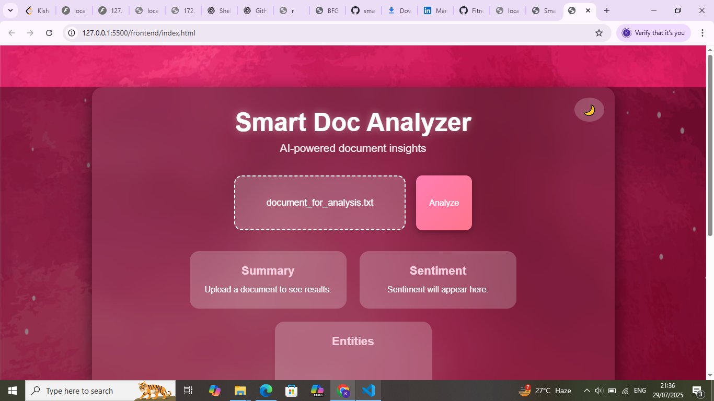
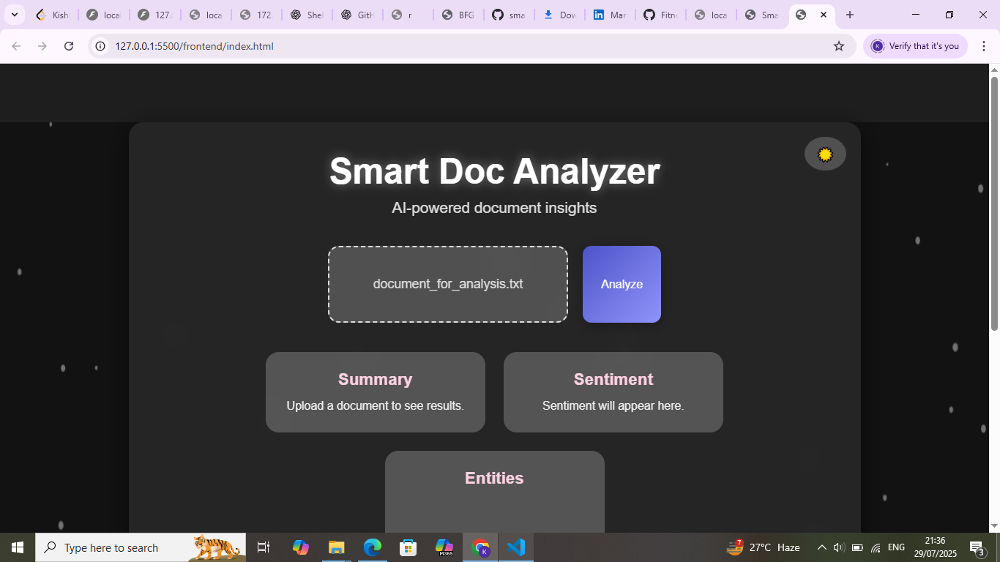

# SmartDoc Analyzer  

**SmartDoc Analyzer** is an AI-powered document analysis platform that performs document summarization, sentiment analysis, and entity extraction using **HuggingFace Transformers** and **AWS Comprehend**.  

It supports file uploads, secure storage on AWS S3, and metadata storage in DynamoDB, all wrapped in a **FastAPI backend** with an **interactive frontend**.

## � Features  

### Core Functionality
- **Document Upload** – Upload `.txt` or `.pdf` documents via the frontend  
- **AI-Powered Summarization** – Summarize documents using HuggingFace BART  
- **Sentiment Analysis** – Detect sentiment using AWS Comprehend  
- **Entity Extraction** – Identify key entities (people, organizations, locations)  

## **🎥 Demo Video**

### Cloud Integration
- Store documents in **AWS S3**  
- Save metadata (summary, sentiment, entities) in **AWS DynamoDB**  
- Secure access with **AWS IAM** roles & policies  

### Deployment Options
- Run locally with Docker  
- Scalable deployment on **Kubernetes** (Minikube)  
- Cloud-hosted option on **AWS EC2**  

### User Experience
- Clean, responsive UI  
- Interactive animations for uploads and results  

## 🛠 Tech Stack  

### Frontend
- HTML5, CSS3, JavaScript  
- Responsive design with CSS Flexbox/Grid  

### Backend
- **FastAPI** (Python)  
- **HuggingFace Transformers** (`facebook/bart-large-cnn`)  

### AWS Services
| Service       | Purpose                          |
|--------------|----------------------------------|
| S3           | Document storage                 |
| DynamoDB     | Metadata storage                 |
| Comprehend   | Sentiment & entity analysis      |
| IAM          | Access management                |
| EC2          | Cloud hosting (optional)         |

### DevOps
- **Docker** – Containerization  
- **Kubernetes** – Minikube for local clustering  

## 📂 Project Structure  

smart-doc-analyzer/
│
├── backend/                     # FastAPI backend
│   ├── app.py                   # Main application
│   ├── aws_utils.py            # AWS integration
│   ├── requirements.txt        # Dependencies
│   └── Dockerfile              # Container configuration
│
├── frontend/                    # User interface
│   ├── index.html              # Main page
│   ├── style.css               # Styling
│   ├── app.js                  # Client-side logic
│   └── Dockerfile              # Frontend container
│
├── k8s/                         # Kubernetes configs
│   ├── backend-deployment.yaml
│   ├── frontend-deployment.yaml
│   ├── service-*.yaml          # Service definitions
│   └── aws-secret.yaml         # Credentials (gitignored)
│
├── .env                         # Environment variables
└── README.md                    # This documentation

## Run with Docker 

## Docker Deployment

### Build containers
docker compose build

### Start services
docker compose up -d

### Access application
http://localhost:8080

## Run on Kubernetes (Minikube)

### Start cluster
minikube start --driver=hyperv

## 🐳 Run with Docker & Kubernetes

### 1. Build Images  
docker build -t smart-doc-analyzer-backend ./backend
docker build -t smart-doc-analyzer-frontend ./frontend

## Access service
minikube service smartdoc-frontend-service

## **🖼️ Screenshots**

### Dashboard View

### Analysis Results

### 📌 Future Enhancements

- PDF support with PyMuPDF

- Multi-language processing

- Role-based authentication

- Batch processing capability
